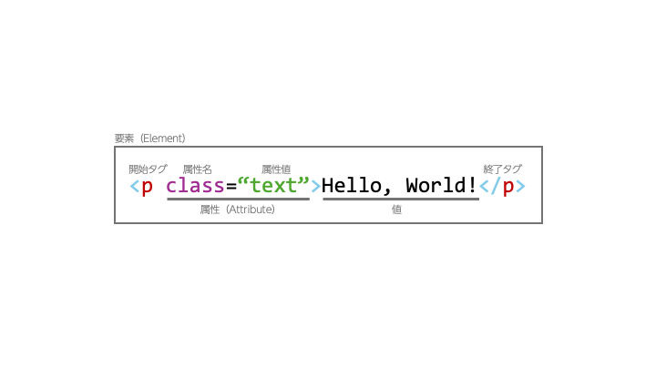
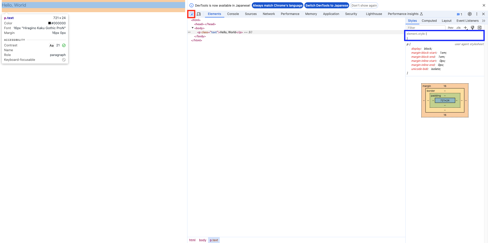

# 1 HTML とは

## 1.1 概要

HTML とは Hypertext Markup Language の略で、**Web ページの構造を記述するために用いるマークアップ言語**です。記述とはタイトルや画像、テキストやリンクなどのことを指します。通常、Web ページを構築する際には HTML でドキュメントを構築し、CSS を用いてページにデザインを与えます。必要に応じて JavaScript 等の言語を使用してページにインタラクティブな要素を追加したり、追加の通信を行ったりすることもあります。ここで注意したいのは、**HTML は Web ページのデザインを記述するものではない**という点です。あくまでも **Web ページに載せるドキュメントを記載するものであるため、常に最小限でシンプルであること**が求められます。

## 1.2 HTML の構造

### 1.2.1 タグと要素

次の Listing1 は最小限の HTML ドキュメントです。

**Listing1：最小限の HTML**

```html
<p>Hello, World</p>
```

---

#### 演習 1

`practice-1.html` を作成し、Listing1 のコードを記述・保存して Web ブラウザで表示させてみましょう（ヒント：VSCode のファイルツリー上の HTML ファイルを Web ブラウザ上にドラッグ & ドロップすることで表示させることができます）。

---

要素は `<xxx>` から `</xxx>` で囲まれた部分のことを指し、とりわけ `<xxx>` を**開始タグ**、`</xxx>` を**終了タグ**と呼びます。これらをまとめて**タグ**と呼ぶこともあります。また `xxx` の部分を**タグ名**と呼びます。なお、**HTML ではタグ名として使用できる文字列は決まっています**が、React をはじめとしたコンポーネント指向の Web 開発フレームワークを使用する場合にはその限りではありません（厳密にはそれらのフレームワークで使用する言語は HTML ではなく、JSX や TSX などと呼ばれる、拡張された HTML と JavaScript をあわせたような言語を使用します）。

先程、HTML を階層的に記述することによってドキュメントを構築すると述べました。これは、要素の中に要素を入れ込むことができることに所以します（これを**ネスト**と言います）。タグの種類にもよりますが、基本的には**要素の中には 0 個以上の任意の要素を入れることができます**。Listing1 の例では、body 要素の中に html 要素が、html 要素の中に p 要素が存在しています。

### 1.2.2 コメント

HTML ドキュメント上には次のような書式でコメントを書くことができます。

**Listing2：コメント**

```html
<!-- コメント -->
```

コメントは `<!--` で始まり `-->` で終わります。なお、コメントの中に `-->` という文字列を挿入することはできません。また、コメントは要素と同じように記述でき、要素が生起することができる場所ならどこにでも書くことができます。

### 1.2.3 属性

次の Listing3 は Listing1 の HTML を少しだけ改変したものです。

**Listing3：最小限の HTML（改変）**

```html
<p class="text">Hello, World</p>
```

`p` 要素の中に `class="text"` という記述が追加されました。これが**属性（Attribute）**です。`a` の部分を**属性名**、`b` の部分を**属性値**と呼びます。属性は開始タグの中に `a="b"` の形で記述し、複数個記述する場合には属性どうしを空白スペースで区切ります。ただし、**同じ名前の属性は一つの要素の中で一つ**しか記述できません。また属性を入れ子にすることはできず、属性の順番に意味はありません。

Listing2 の例では `a` が `class` に、`b` が `"text"` に該当します（これらの属性の意味はここでは重要ではないため割愛します）。各タグで使用できる要素が予め定められており、これは MDN などのドキュメントで確認することができます。

ここまでの記述をまとめると次の Fig1 の図のようになります。

**Fig1：HTML 要素のまとめ**


---

#### 演習 2

1. Listing3 のコードを適当な HTML ファイルに保存し、ブラウザで開いてください。
2. 開発者ツールを開いて図 Fig2 の赤い枠の示すボタンをクリックし、マウスカーソルを `Hello, World` の上に持っていくことで画像のような状態にしてください。
3. その状態でマウスを一度クリックし、さらに青い枠の示す部分をクリックしてください。そして `color: green` と入力して Enter キーを押してください。どうなるでしょうか。



開発者ツールは Web 開発を行う上で必要なツールですので、早めにマスターしておくといいでしょう。

---

### 1.2.4 HTML の構造

HTML ドキュメントは、ほとんどの場合次のような構造をしています。

**Listing3：HTML の構造**

```html
<!DOCTYPE html>
<html>
  <head>
    <meta charset="utf8" />
    <title>HTMLのテスト</title>
  </head>
  <body>
    <p>Hello, World</p>
  </body>
</html>
```

この HTML をファイルに記述して表示させても Listing1 の実行結果と遜色ないことでしょう。これは、Listing3 は Listing1 の内容を HTML の仕様に沿って正しく記述したものであるからです。

一般に、HTML にはテキストをはじめとした文書情報だけではなく、文書に関連する**メタデータ**も同時に記述します。そのため、最終的な HTML ファイルは次のような構造となります。

- `DOCTYPE` 宣言
  - この HTML 文書のバージョン情報を記述します。現行の最新バージョンである HTML Living Standard ではファイル先頭にこのように記述することが求められます。この記述を省略した場合、一部のブラウザでは HTML 互換モードと呼ばれるモードで HTML ファイルが読み込まれ、JavaScript の多くの機能が動作しなかったり、一部の HTML 要素が正しくレンダリングされなくなったりする可能性があります。
- `html` 要素
  - すべての HTML 要素はこの中に記述される必要があります。
- `head` 要素
  - この要素の中では、この**ドキュメントのメタデータを記述**します。この要素内で行う代表的なメタデータの扱いに、文字コードの指定や外部 CSS / JS の読み込みがあります。
  - Listing3 の例にある `meta` 要素は文字コードの宣言を行っています。終了タグがないため誤っているように見えますが、これは正しい記述です。
  - `title` 要素ではこの **HTML ドキュメントのタイトルを指定**します。ここに記述したタイトル1は、例えば Google 検索でのページタイトルや、このページをブラウザで表示している際のタブに表示されるテキストとして現れます。
- `body` 要素
  - この要素の中身が実際の内容であることを示します。