# 2 HTML を構成する要素

この章では HTML を構成する要素について説明します。各項目には MDN における詳細説明のリンクを置いているので、適宜参考にしてください。

ただし、実際にはここに記述していない数多くの要素があります。MDN の [HTML 要素リファレンス](https://developer.mozilla.org/ja/docs/Web/HTML/Element)にすべての要素の説明があるので、必要に応じて参照してください。また吉川ウェブによる [HTML5 入れ子チートシート](https://yoshikawaweb.com/element/)では、どの要素をどの要素にいれて良いかを確認することができるので、実際の開発中には大いに役立ちます。

なお、本章で示す HTML での記述例では `<html><body> ~ </body></html>` の記述を省略しています。実際には `body` 要素の中に記述されるものであることに注意してください。

## 2.1 ブロックレベル要素

ブロックレベル要素は、見出しや段落、表など、**ドキュメントにおけるある程度大きな塊**を表します。HTML におけるブロックレイアウトでは、**ブロックレベル要素は上から下へ、垂直にレイアウト**されます。また、**ブロックレベル要素は親の要素の左側の辺に沿って配置**されます。

例えば次の Listing1 に示す HTML を記述した場合、Fig1 に示すような表示がされます。

**Listing1：ブロックレベル要素の記述例**

```html
<div>
  <!-- style="background-color: red" は背景色を指定するための CSS を記述するための属性 -->
  <p style="background-color: red">これは段落1のテキストです。</p>
  <p style="background-color: blue">これは段落2のテキストです。</p>
</div>
```

**Fig1：ブロックレベル要素の表示例**

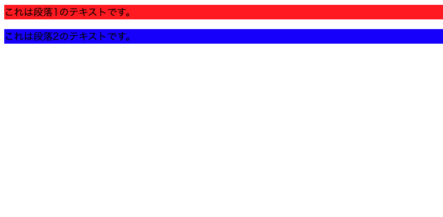

以後では、よく使われるブロックレベル要素を列挙します。

## 2.2 よく使われるブロックレベル要素

### 2.2.1 h1-h6：見出し

[HTML の見出し要素](https://developer.mozilla.org/ja/docs/Web/HTML/Element/Heading_Elements)

> セクションの見出しを 6 段階で表します。`<h1>` が最上位で、`<h6>` が最下位です。

**Listing2：見出しの記述例**

```html
<h1>これは h1 の見出しです</h1>
<h2>これは h2 の見出しです</h2>
<h3>これは h3 の見出しです</h3>
<h4>これは h4 の見出しです</h4>
<h5>これは h5 の見出しです</h5>
<h6>これは h6 の見出しです</h6>
```

**Fig2：見出しの表示例**

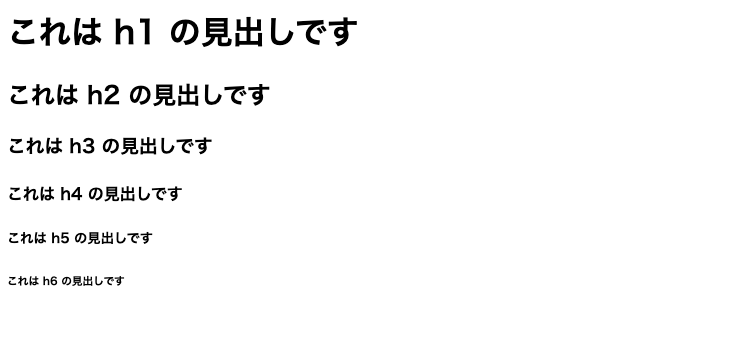

### 2.2.2 p：段落

[段落要素](https://developer.mozilla.org/ja/docs/Web/HTML/Element/p)

> テキストの段落を表します。視覚メディアにおいて、段落はふつう隣接するブロックと上下の空白や最初の行の字下げによって隔てられたテキストのブロックとして表現されますが、 HTML の段落は画像やフォーム欄などの関連するコンテンツを構造的にまとめることができます。

### 2.2.3 ul / li：順序なしリスト

[順序なしリスト要素](https://developer.mozilla.org/ja/docs/Web/HTML/Element/ul)

> 項目の順序なしリストを表します。一般的に、行頭記号を伴うリストとして描画されます。

**Listing3：順序なしリストの記述例**

```html
<ul>
  <li>項目1</li>
  <li>項目2</li>
  <li>項目3</li>
  <li>項目4</li>
  <li>項目5</li>
</ul>
```

**Fig3：順序なしリストの表示例**

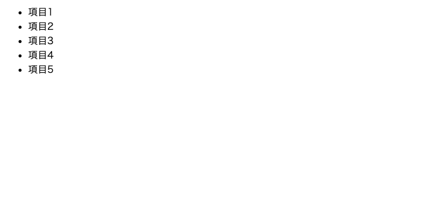

### 2.2.4 ol / li：順序付きリスト

[順序付きリスト要素](https://developer.mozilla.org/ja/docs/Web/HTML/Element/ol)

> 項目の順序付きリストを表します。ふつうは番号付きのリストとして表示されます。

**Listing4：順序ありリストの記述例**

```html
<ol>
  <li>項目1</li>
  <li>項目2</li>
  <li>項目3</li>
  <li>項目4</li>
  <li>項目5</li>
</ol>
```

**Fig4：順序なしリストの表示例**

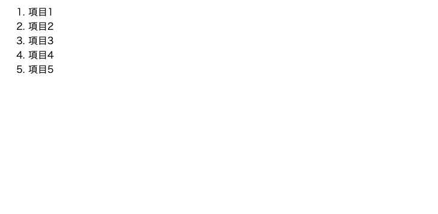

### 2.2.5 table：表

[表要素](https://developer.mozilla.org/ja/docs/Web/HTML/Element/table)

> 表形式のデータ、つまり、行と列の組み合わせによるセルに含まれたデータによる二次元の表で表現される情報です。

- `caption` 要素では表のタイトルを指定します。視覚的には近くに `p` 要素を配置することなどでもd代替できますが、その場合には表のタイトルと表をデータ的に結びつけることができなくなってしまいます。
- `thead` 要素では表のヘッダ行を記述します。ヘッダは表の一行目です。
- `th` 要素ではヘッダの列（カラム）を記述します。
- `tbody` 要素では表の内容部分を記述します。
- `tr` 要素ではヘッダ行を除く表の各行を記述します。
- `td` 要素ではヘッダ行を除く表の各列を記述します。

**Listing5：表の記述例**

```html
<table>
  <caption>
    情報学群の学類別略称
  </caption>
  <thead>
    <tr>
      <th>学類</th>
      <th>略称</th>
    </tr>
  </thead>
  <tbody>
    <tr>
      <td>情報科学類</td>
      <td>coins</td>
    </tr>
    <tr>
      <td>情報メディア創成学類</td>
      <td>mast</td>
    </tr>
  </tbody>
</table>
```

**Fig5：表の表示例**

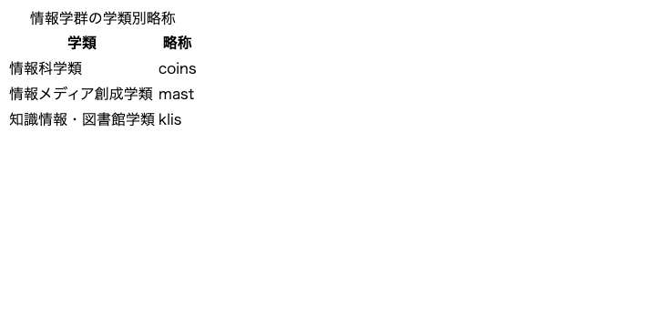

### 2.2.6 div：コンテンツ区分

[コンテンツ区分要素](https://developer.mozilla.org/ja/docs/Web/HTML/Element/div)

ブロックレベル要素をグループ化します。Listing1 の例で使用していますが、Fig1 の図で明らかなようにそのままの状態では `div` 要素は視覚的な表現を持ちません。この要素は通常、CSS でドキュメントを装飾したい場合などに使用します。

### 2.2.7 演習
Listing5 に示した表のコードを編集して、`知識情報・図書館学類：klis` の行を追加してください。また、全体に `キャンパス` の列を追加して、上から順に `三学` `春日` `春日` と指定してみましょう。

## 2.3 インラインレベル要素

インラインレベル要素は、ブロックレベル要素の中に入る要素で、画像や強調、ハイパーリンクなどを表します。垂直にレイアウトされるブロックレベル要素に対して、インラインレベル要素は**通常右方向に整列してレイアウト**されます（例えばアラビア語設定では右から左へレイアウトされるなど、厳密には書字方向に応じてレイアウトされます）。

次の Fig6 の図はブロックレベル要素とインラインレベル要素のレンダリング方向を表した模式図です。

**Fig6：ブロックレベル要素とインラインレベル要素のレンダリング方向（[Inline-level content (インラインレベルコンテンツ) - MDN Web Docs 用語集: ウェブ関連用語の定義 | MDN](https://developer.mozilla.org/ja/docs/Glossary/Inline-level_content) より引用）**


### 2.3.1 a：アンカー

[アンカー要素](https://developer.mozilla.org/ja/docs/Web/HTML/Element/a)

> href 属性を用いて、ウェブページ、ファイル、メールアドレス、同一ページ内の場所、または他の URL へのハイパーリンクを作成します。

**Listing6：アンカーの記述例**

```html
<a href="https://www.tsukuba.ac.jp/">筑波大学のサイト</a>
```

**Fig7：アンカーの表示例**

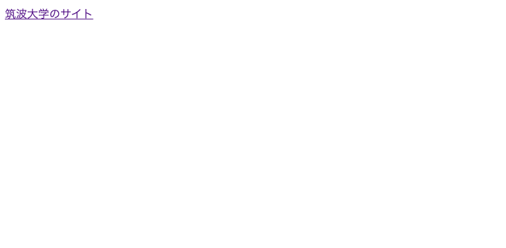

### 2.3.2 img：画像埋め込み

[画像埋め込み要素](https://developer.mozilla.org/ja/docs/Web/HTML/Element/img)

> 文書に画像を埋め込みます。

画像を埋め込むときは、**`alt` 属性も同時に指定すべき**ことに注意してください。`alt` 属性は画像の説明を記述するための属性ですが、基本的には無くても多くの人には問題がありません。しかし画像の説明がない場合、スクリーンリーダ等を使用する視覚障がい者がドキュメントの内容を把握する際の障壁となってしまいます。

**Listing7：画像埋め込みの記述例**

```html
0
```

**Fig8：画像埋め込みの表示例**


## 2.4 フォームで使用する要素
例えば Web 上で何らかの申請を行うときには、名前を入力したり性別を選択したりなど、何らかの形でユーザが情報を入力することがあります。このような仕組みを**フォーム**と呼び、通常は JavaScript と組み合わせて使用されます。フォームで使用される要素には様々なものがありますが、ここではその一例を取り上げます。

なお、以下では `form` 要素を除いた要素の HTML 例は `form` 要素の中に書かれるものとします。

### 2.4.1 form：フォーム

[フォーム要素](https://developer.mozilla.org/ja/docs/Web/HTML/Element/form)

> ウェブサーバーに情報を送信するための対話型コントロールを含む文書の区間を表します。

`form` 要素には視覚的な表現は何もありません。form 要素の子要素はフォームを構成する一連の部品とみなされ、「送信」ボタンを押下することで各要素に入力された情報を外部のサーバーに送信します。詳細は演習の部分で説明します。

### 2.4.2 input：入力欄（フォーム入力）/ textarea：テキストエリア

- [入力欄（フォーム入力）要素](https://developer.mozilla.org/ja/docs/Web/HTML/Element/form)
  - > ユーザーからデータを受け取るための、ウェブベースのフォーム用の操作可能なコントロールを作成するために使用します。
- [テキストエリア要素](https://developer.mozilla.org/ja/docs/Web/HTML/Element/textarea)
  - > 複数行のプレーンテキスト編集コントロールを表し、レビューのコメントやお問い合わせフォーム等のように、ユーザーが大量の自由記述テキストを入力できるようにするときに便利です。

次の例では 4 文字から 8 文字までを入力可能なテキストボックスと 5 行 33 列のテキストエリアを表示しています。また、`input` 要素の代わりに `textarea` 要素を用いることで複数行テキストを入力することも出来ます。

**Listing11：入力欄の記述例**

```html
<div>
    <p><label for="name">名前 (4 から 8 文字まで):</label></p>
    <input type="text" id="name" name="name" placeholder="名前を入力..." required minlength="4" maxlength="8" size="10" />
</div>

<div>
    <p><label for="story">投稿</label><p>
    <textarea id="story" name="story" rows="5" cols="33" placeholder="いまどうしてる？">
デフォルトのテキスト 
    </textarea>
</div>
```

**Fig12：入力欄の表示例**

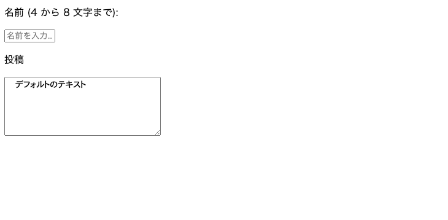

### 2.4.3 input：その他の入力
上で使用した `input` 要素の `type` 属性を変更することで様々な入力を使用することが出来ます。ここではいくつかの例を示します。

その他の選択可能な属性値については [&lt;input&gt;: 入力欄（フォーム入力）要素 - HTML: ハイパーテキストマークアップ言語 | MDN](https://developer.mozilla.org/ja/docs/Web/HTML/Element/input#input_%E3%81%AE%E5%9E%8B) に列挙されています。

**Listing12：その他の入力の記述例**

```html
<div>
    <h3>checkbox</h3>
    <p>
        <input type="checkbox" id="curry" name="curry" checked />
        <label for="scurry">カレー</label>
    </p>
    <p>
        <input type="checkbox" id="sushi" name="sushi" checked />
        <label for="sushi">寿司</label>
    </p>
</div>

<div>
    <h3>date</h3>
    <p>
        <label for="birthday">生年月日：</label>
        <input type="date" id="birthday" name="birthday" value="2003-07-22" min="1900-01-01" max="2024-12-31" />
    </p>
</div>

<div>
    <h3>file</h3>
    <p>
        <label for="avatar">画像を選択してください：</label>
        <input type="file" id="avatar" name="avatar" accept="image/png, image/jpeg" />
    </p>
</div>
```

**Fig13：その他の入力の表示例**

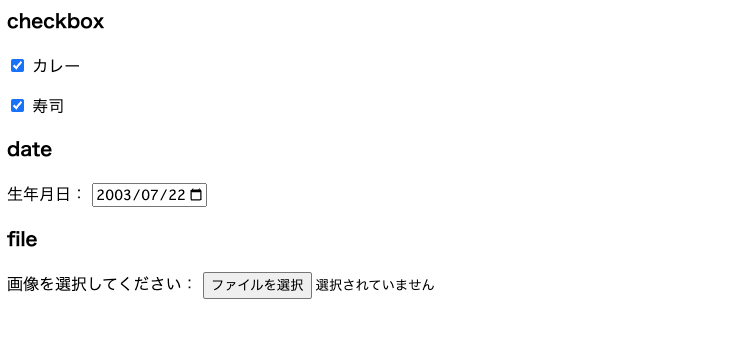

### 2.4.4 演習
1. [webhook.site](https://webhook.site/) は API リクエストにインスタントなテストツールで、HTTP リクエストの送信結果を見ることが出来ます。即ち、フォームの内容をここに送信すると、サーバーから見た受信結果を見ることが出来ます。webhook.site にアクセスして、画面中央「Your unique URL」下部に記載されている URL をコピーしてください（タブは閉じない）。
2. 適当な HTML ファイルを作成し、`form` 要素といくつかのフォーム用の要素を用いて次の画像のようなページを作成してください。  

    <details>
    <summary>
    ヒント
    </summary>
    `form` 要素の `action` 属性に 1 の URL を記述してみましょう。それでも分からない場合は、手順 4 の後に答えとなる HTML を用意してあるので確認してみましょう。
    </details>

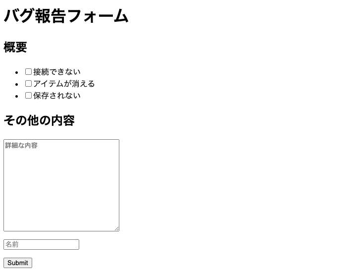
1. 作成した HTML ファイルを開き、適当な入力をして「送信」ボタンをクリックしてください。
2. 1 で開いておいたタブを開き、次の画像の赤枠の部分をクリックし、青色の部分を確認してください。フォームに入力された情報が取得できています。これがフォームの基本です。  
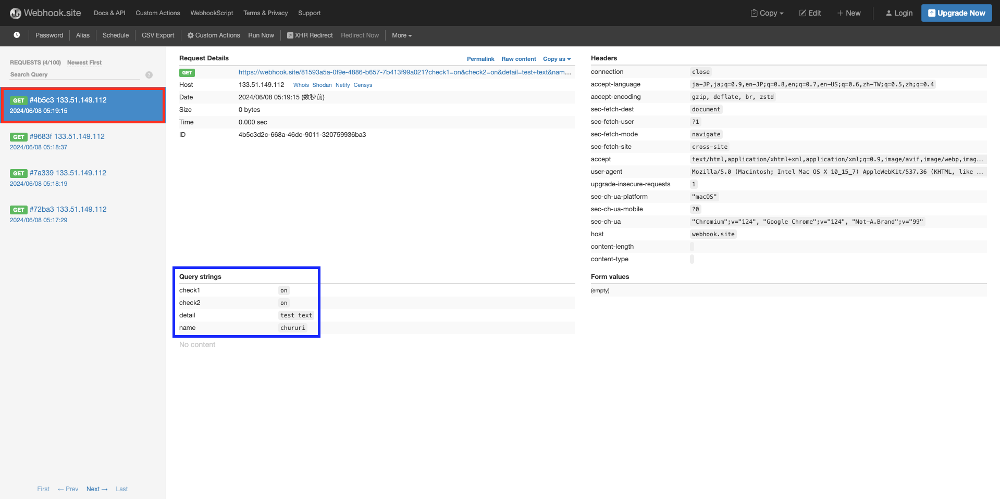

<details>
<summary>
HTML の解答
</summary>

```html
<html>
  <body>
    <h1>バグ報告フォーム</h1>
    <form action="ここに 1 で得た URL を記述する">
      <section>
        <h2>概要</h2>
        <ul>
          <li>
            <input type="checkbox" name="check1" id="check1" /><label
              for="check1"
              >接続できない</label
            >
          </li>
          <li>
            <input type="checkbox" name="check2" id="check2" /><label
              for="check2"
              >アイテムが消える</label
            >
          </li>
          <li>
            <input type="checkbox" name="check3" id="check3" /><label
              for="check3"
              >保存されない</label
            >
          </li>
        </ul>
      </section>
      <section>
        <h2>その他の内容</h2>
        <textarea
          type="text"
          name="detail"
          rows="10"
          cols="30"
          placeholder="詳細な内容"
        ></textarea>
        <p>
          <input type="text" name="name" placeholder="名前" />
        </p>
      </section>
      <input type="submit" value="Submit" />
    </form>
  </body>
</html>

```

</details>


## 2.5 より良い HTML を書くための要素
例えばドキュメント中に時間の記述をしたい場合、あなたならどうしますか？ここまで読んでくれた読者の皆さんなら、おそらく `p` 要素の中に記述すると答えるかもしれません。

視覚的には確かにそれで問題ないかもしれません。ですが、HTML ドキュメントとしてはどうでしょうか。1 章の導入部分で次のように述べました。

> HTML とは Hypertext Markup Language の略で、**Web ページの構造を記述するために用いるマークアップ言語**です。

HTML ドキュメントは Web ページの構造を記述するものです。決して**デザインを行うために構造化するためのものではありません**。HTML によって文書が適切に構造化されることによって、今まで人間しか意味を識別できなかった本のようなただの文章が、初めて機械が解釈可能な**構造化ドキュメント**になります。つまり、HTML の記述は**文章を機械判読が可能なドキュメントになるようにメタデータを付与していく作業**に他ならないのです。

この観点で最初に示した問題を改めて考えてみましょう。`p` 要素では、その記述が時間であるということを機械に教えてあげるには不十分です。幸いなことに、HTML Living Standard（HTML の仕様）では時間を表すための専用の要素（[time](https://developer.mozilla.org/ja/docs/Web/HTML/Element/time)）が用意されています。おそらくこのタグが時間の表現に最も適していることでしょう。

`time` 要素のように、HTML には文章中の情報の**セマンティクス** （意味）を記述するための要素が数多く定義されています。全てを紹介することはできませんが、以下ではその一部を列挙します。

### 2.5.1 time ：（日付）時刻

[（日付）時刻要素](https://developer.mozilla.org/ja/docs/Web/HTML/Element/time)

> 特定の時の区間を表します。datetime 属性を使用して、機械可読な形式の日付を記述することができ、検索エンジンの結果を改善したりリマインダーなどの独自機能に使用したりすることができます。

インラインレベル要素です。表示は通常のテキストと変わりませんが、機械判読可能な時刻の情報を付与することが出来ます。

**Listing8：日付の記述例**

```html
<p>この投稿は<time datetime="2024-06-07">6月7日</time>にされました。</p>
```

**Fig9：日付の表示例**

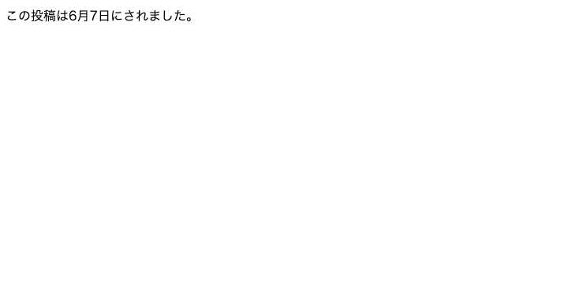

### 2.5.2 article：記事

[記事コンテンツ要素](https://developer.mozilla.org/ja/docs/Web/HTML/Element/article)

> 文書、ページ、アプリケーション、サイトなどの中で自己完結しており、（集合したものの中で）個別に配信や再利用を行うことを意図した構成物を表します。例えば、フォーラムの投稿、雑誌や新聞の記事、ブログの記事、商品カード、ユーザーが投稿したコメント、対話型のウィジェットやガジェット、その他の独立したコンテンツの項目が含まれます。

**Listing9：記事の記述例**

```html
<article>
    <h2>記事一覧</h2>
    <article>
        <h3>動物園に行きました</h3>
        <p>猿が有名だという動物園があるそうなので、猿好きの私は...</p>
        <a href="#">もっと見る</a>
    </article>
    <article>
        <h3>WebAssemblyを試してみた</h3>
        <p>最近のWebフロントエンド界隈ではWebAssemblyが話題のようです。私はRustが...</p>
        <a href="#">もっと見る</a>
    </article>
</article>
```

**Fig10：記事の表示例**

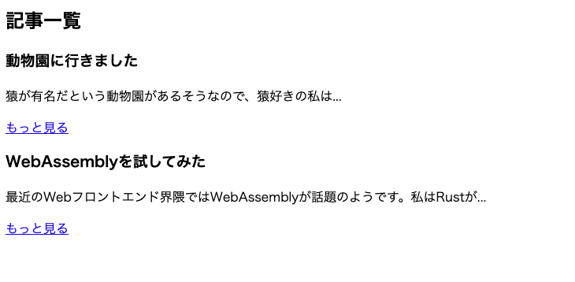

### 2.5.3 section：セクション

[汎用セクション要素](https://developer.mozilla.org/ja/docs/Web/HTML/Element/section)

> 文書の自立した一般的なセクション（区間）を表します。そのセクションを表現するより意味的に具体的な要素がない場合に使用します。少数の例外を除いて、セクションには見出しを置いてください。

**Listing10：セクションの記述例**

```html
<article>
    <h2>筑波大学情報メディア創成学類の紹介</h2>
    <section>
        <h3>概要</h3>
        <!-- https://www.mast.tsukuba.ac.jp/outline/college.html より引用 -->
        <p>インターネットの爆発的な普及は、グーテンベルグによる活字印刷技術の登場に匹敵するコミュニケーション革命と言われ、産業・ビジネス、教育・文化・生活のすべてに変化がもたらされてきています。このような変化の時代に活躍できる技術者を養成するのが情報メディア創成学類です。</p>
    </section>
    <section>
        <h3>英語表記</h3>
        <p>情報メディア創成学類はCollege of Media Arts, Science and Technology の略で、mast と略されます。</p>
    </section>
</article>
```

**Fig11：セクションの表示例**

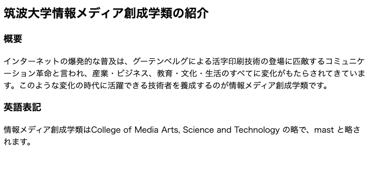

### 2.5.4 演習
次の画像 Fig14 は [Yahoo! JAPAN](https://www.yahoo.co.jp/) の PC 版におけるトップページのスクリーンショットです。この中で `article` 要素、`section` 要素、`footer` 要素に該当する部分はそれぞれどの部分でしょうか。ソースコードを見ずに考えてみましょう。また、なぜその要素で実装されているかについても考えてみてください。

**Fig14：Yahoo! JAPAN のトップページ（2024/6/8）時点**
  
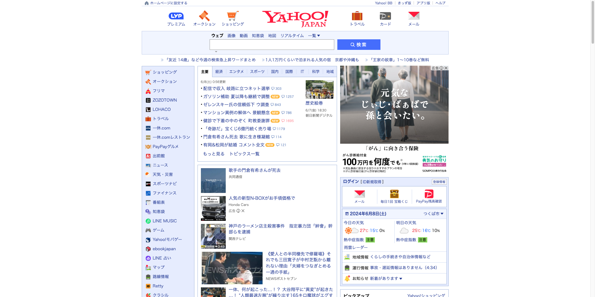

終わったら開発者ツールで確認してみましょう。

# 2.6 さいごに

1 章の冒頭では HTML について次のように述べました。

> **HTML は Web ページのデザインを記述するものではない**という点です。あくまでも **Web ページに載せるドキュメントを記述するものであるため、常に最小限でシンプルであること**が求められます。

一般に、文書は構造化されていればされているほどよいとされています。適切に構造化された文書はアクセシビリティ、検索性に優れ、人間にも計算機にもわかりやすいコンテンツとなります。究極には、Web ブラウザによってレンダリングされていない生の HTML コードを読むだけで、内容のどの部分とどの部分が関連付けられているかやどこまでが一つの区切りかが分かるような状態が望ましいです。優れた HTML は、コード上のコメントを読まずとも（あるいは存在しなくとも）他の人が実装者の意図やページの構造が分かるなど、チーム開発においても効果を発揮します。

また、世の中にはデザインを無効化する「リーダーモード」を使用して Web を閲覧する人がいます。リーダーモードとは CSS を外した状態の HTML のみをレンダリングする Web ブラウザの機能です。加えて視覚障がいを持つ方々の中には、スクリーンリーダと呼ばれる Web ページを読み上げる機能を使用する人がいます。こういった機能は Web ページが適切に構造化されていることを前提にして成立していますが、もしあなたの作成した HTML ドキュメントがデザインや面倒臭さのために突飛な構造になっていたらどうでしょうか。趣味の範囲内のページであれば問題がないかもしれませんが、多くの人がアクセスするページであれば、それだけで批判の対象になったり、ページランクの低下、ユーザ数の低下などに繋がります。そういった問題を避けるためにも、適切に構造化された HTML を書くことは常に意識したいものです。