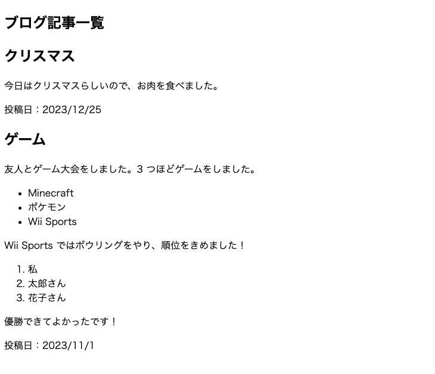

# 2 - 演習
## 2.1 アクセシビリティを考慮した HTML
[Yahoo! JAPAN](https://www.yahoo.co.jp/) の トップページでは、「HTML 上には存在するが実際には表示されていない見出し」が数多くあります。先程述べた開発者ツールを使用して、このような例を探してみましょう。また、なぜこのような実装になっているかを考えてみましょう。

## 2.2 HTML を使用したページの作成
下のようなページを出力する HTML 文書を `practice-2_3.html` として作成してください。見た目があっていれば大丈夫ですが、できるだけ**文書の構造化**を意識することを心がけてください。なお解答例は `samples/answer-2_3.html` にあります。

