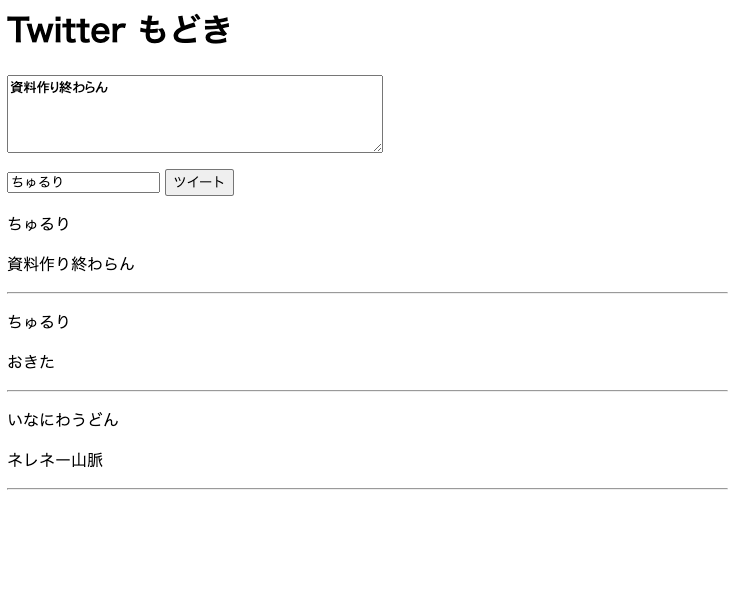

# 9 - DOM
> **ドキュメントオブジェクトモデル** (Document Object Model, DOM) は、ウェブページを表す HTML のような文書の構造をメモリー内に表現することで、ウェブページとスクリプトやプログラミング言語を接続するものです。（[ドキュメントオブジェクトモデル (DOM) - Web API | MDN](https://developer.mozilla.org/ja/docs/Web/API/Document_Object_Model) より引用）

即ち、DOM は **HTML ドキュメントにプログラムからアクセスするためのインターフェース**です。DOM を用いることで、例えば JavaScript からドキュメントのレイアウトを制御したり、逆にボタンがクリックされた時に処理を行うことができるようになります。

## 9.1 要素の取得
### 9.1.1 id による取得
JavaScript で DOM から要素を取得するには、`geteElementById` メソッドなどを使用します。次の Listing1 は、HTML ドキュメントから id　が `test` の要素を取得する処理です。

**Listing1：getElementById による要素の取得**
```html
<p id="test">Test Text</p>

<script>
    const testElement = document.getElementById('test');
</script>
```

### 9.1.2 クエリセレクタによる取得
id 以外でも**クエリセレクタ**によっても取得することができます。クエリセレクタとは、CSS で特定の種類の要素を表すための記法で、例えば次のようなものがあります。

- `p`：`p` 要素全て
- `.test-class`：`test-class` というクラスを持つ要素全て
- `#test`：id が `test` の要素
- `div > .elem`：`div` 要素直下の `elem` クラスを持つ要素全て
- `.test-class .elem`：`test-class` クラスを持つ要素の下の `elem` クラスを持つ要素全て

つまり識別子のみではタグ、`.` + 識別子でクラス名、`#` + 識別子で id を示します。また、セレクタどうしをスペース区切りで連結すると孫を含めた要素を、`>` で連結すると直下の子要素のみを取得できます。

クエリセレクタによる要素の取得は次の通りです。

**Listing2：querySelector による要素の取得**
```js
// test-class というクラスを持つ要素全て
const elements = document.querySelectorAll('.test-class');

// elem というクラスを持つ要素一つ
const element = document.querySelector('.elem');
```

### 9.1.3 クラス名による取得
`getElementByClassName` メソッドを用いると、クラスによっても要素を取得することが出来ます。

**Listing3：getElementsByClassName による要素の取得**
```js
// test-class というクラスを持つ要素全て
const elements = document.getElementsByClassName('test-class');
```

## 9.2 イベント駆動型プログラミング
Web プログラミングでは、しばしばユーザがボタンをクリックしたときや、マウスカーソルが動いたとき、ページがロードされた時など、**何らかの状況の変化が発生した際に行う処理を記述する**ことがあります。このような状況の変化のことを**イベント**と呼び、イベントの発生によって処理が行われるようなプログラムを記述することを**イベント駆動型プログラミング**と呼びます。

イベント駆動型プログラミングでは、イベントを表すオブジェクト、そして**イベントリスナ**の 2 つから構成されます。イベントリスナは通常、関数で表され、その引数としてイベントを表すオブジェクトを受け取ります。

### 9.2.1 JavaScript でのイベントリスナの登録
次の Listing4 のコードは、id が `test-button` のボタンがクリックされた時のイベントリスナを登録する例です。

**Listing4：イベントリスナの登録**
```js
const button = document.getElementById('test-button');
button.addEventListener('click', (e) => {
    alert('クリックされました！');
});
```

具体的には `(e) => {` の部分から `}` の部分がイベントリスナとなる関数で、`addEventListener` メソッドによってイベントリスナが登録されています。今回は `click` イベントに対して登録をしています。

なお　`addEventListener` メソッドは第二引数で関数を受け取っていることから、高階関数であることも観察できます。

### 9.2.2 HTML でのイベントリスナの登録
イベントリスナの登録は onXXX 属性を用いることで HTML によっても行うことができます。

**Listing5：HTML によるイベントリスナの登録**
```html
<button onClick="onClickListener">テストボタン</button>

<script>
    function onClickListener(e) {
        alert('クリックされました！');
    };
</script>
```

このとき、定義する関数名と HTML に記述する関数名は一致させる必要があります。また、属性には**関数名のみを記述し、`()` は記述しません**。さらに、指定する関数はトップレベルに宣言されたもののみ指定することができます。

アロー関数を用いることで、JavaScript 上で関数を宣言しなくても直接処理を記述することができますが、これはイベントリスナの処理が短い場合にのみ使用してください。長すぎるとバグや可読性の低下の原因となります。

**Listing6：アロー関数を用いたイベントリスナ**
```html
<button onClick="() => { alert('クリックされました！'); }">テストボタン</button>
```

リッスンできるイベントの種類は要素によって異なり、それらは MDN のドキュメントなどによって確認することができます。

### 9.2.3 演習
イベントリスナを用いて、テキストエリアに入力された文字数をカウントする HTML / JS プログラムを記述してください。画面上にはテキストエリアとカウントを実行するためのボタン、そして文字数表示のためのテキストの 3 つのみが存在していればレイアウトは問いません。

なお入力された文字の取得などは現時点では扱っていませんので、適宜調べながら実装してください。

さらに発展的な課題として、ボタンを削除して入力と同時に文字数がカウントされるようにプログラムを書き直してみましょう。これは余力のある人だけで大丈夫です。

## 9.3 要素の操作
要素を取得すると、属性や値の取得・書き換えなど、さまざまなことを行えるようになります。次の Listing7 はできる操作の一例を列挙したものです。

**Listing7：要素の操作例**
```html


<p id="text">Hello, World!</p>

<div id="root"></div>

<input type="text" id="name" name="name">

<input type="checkbox" id="is-man" name="is-man">

<script>
    // src 属性を変えて画像を入れ替える
    const image = document.getElementById('image');
    image.setAttribute('src', 'https://blogger.googleusercontent.com/img/b/R29vZ2xl/AVvXsEjBDXB7T2VwiPGEIv8E2Sr-HULMtei_LhpM_fJxlVYCfgDt8rf-K0TPvViJRmMSaAG-mF7c2nnKru4vXrbOmwpOGZbo-eDZOC34hWYFh6FvPPBlX_XoL6FEsCz1SB5M-M-IQ4EPFei-OsRMokCHVImt-O62m0Dnynvrf190-uIviTsLlXt1LH2TC_LeEBlO/s400/food_eiyoukinou.png');

    // テキストを変える
    const text = document.getElementById('text');
    text.innerText = 'Changed!';

    // 内部の HTML を変える
    const root = document.getElementById('root');
    root.innerHTML = '<p>mounted!</p>';

    // 入力値（テキスト）を取得する
    const input = document.getElementById('name');
    const name = input.value;

    // 入力値（チェックボックス）を取得する
    const checkBox = document.getElementById('is-man');
    const isMan = checkBox.checked;
</script>
```

## 9.4 要素の生成と追加
### 9.4.1 要素の生成
今までは要素を取得することを行ってきましたが、逆に要素を生成することもできます。要素の生成には `createElement` メソッドを使用します。

**Listing8：要素の生成**
```js
const pElement = document.createElement('p');
```

`createElement` メソッドの第一引数で要素の種類を指定します。要素の種類には HTML の仕様にはない名前も指定することができますが、基本的には仕様の範囲内のものを使用します。上記の例では `p` 要素を生成しています。生成した要素は 9.3 節で述べたような操作が可能です。`setAttribute` メソッド利用して属性を設定などを設定することができます。

**Listing9：属性の設定**
```js
const pElement = document.createElement('p');

// id: test を設定
pElement.setAttribute('id', 'test');
```

### 9.4.2 appendChild による要素の追加
要素を生成したら、何らかの方法で HTML ドキュメント上に追加する必要があります（これを**動的に追加する**と言います）。まずは `appendChild` メソッドによる要素の追加について述べます。Listing10 を見てください。

**Listing10：要素の追加**
```html
<div id="root">
    <p>test</p>
</div>

<script>
    // 要素を生成
    const pElement = document.createElement('p');

    // 値を設定
    pElement.value = 'Hello, World!';

    // 追加
    document.getElementById('root').appendChild(pElement);
</script>
```

`appendChild` は `getElementById` などで得られる Element 型の（厳密にはElement の親の Node 型のメソッドで、子要素の末尾に要素を追加します。即ち、Listing10 のコードを実行した後の HTML ドキュメントは次のようになることでしょう。

**Listing11：要素の追加後のドキュメント**
```html
<div id="root">
    <p>test</p>
    <p>Hello, World!</p>
</div>
```

### 9.4.3 insertAdjacentElement による要素の追加
前節の `appendChild` メソッドは子要素の末尾に要素を追加するものでしたが、`insertAdjacentElement` メソッドではもっと柔軟に要素を追加することができます。`insertAdjacentElement` は第一引数に位置を表す文字列、第二引数には追加する要素を指定しますが、第一引数に指定できる値は次の通りです。この値によって追加位置が変化します。

- `beforebegin`：呼び出し元要素の直前
- `afterbegin`：呼び出し元要素の直下、最初の子要素の直前
- `beforeend`：呼び出し元要素の直下、最初の子要素の後
- `afterend`：呼び出し元要素の直後

つまり、要素の挿入位置は次の Listing12 の示すような位置となります。

**Listing12：要素の追加位置**

```html
<!-- beforebegin -->
<div>
  <!-- afterbegin -->
  <p>foo</p>
  <!-- beforeend -->
</div>
<!-- afterend -->
```

次からは例を見て見ましょう。

**Listing13：insertAdjacentElementの例**

```html
<div id="root"></div>

<script>
    // 要素を生成
    const pElement = document.createElement('p');

    // 値を設定
    pElement.value = 'Hello, World!';

    // 追加
    document.getElementById('root').insertAdjacentElement('afterbegin' pElement);
</script>
```

### 9.4.4 演習
今までに学習したことを駆使して、Twitter もどきを作ってみましょう。下に要件を示します。

- ツイートボタンがクリックされたら一番上に最新のツイートが表示されること
- ツイートの投稿が完了したらテキストエリアなどの値はクリアされること
- 内容または名前が 0 文字である場合にはエラーのアラートを表示すること
- Fig1 のようになっていれば使用する HTML 要素や構造は問わない

さらに発展的な要件を示します。必ずしもここまで実装する必要はありません。

- 名前と投稿内容のスタイルが区別されていること
- 名前の左側にアイコンが表示されていること（全員同じで良い）
- 文字数制限を課すこと

**Fig1：実装例**


<details>
    <summary>
    解答例
    </summary>

```html
<html>
    <body>
        <header>
            <h1>Twitter もどき</h1> 
            <textarea id="text" rows="4" cols="50" minlength="1" maxlength="140" placeholder="いまなにしてる？"></textarea>
            <p>
                <input type="text" id="name" minlength="1" placeholder="なまえ">
                <button id="tweet">ツイート</button>
            </p>
        </header>

        <main>
            <section id="tweets"></section>
        </main>
        
        <script>
            // DOM要素を取得
            const tweet = document.getElementById('tweet');
            const text = document.getElementById('text');
            const name = document.getElementById('name');
            const tweets = document.getElementById('tweets');

            // ツイートボタンがクリックされたときの処理
            tweet.addEventListener('click', () => {
                const article = document.createElement('article');
                const n = document.createElement('p');
                n.textContent = name.value;
            
                const t = document.createElement('p');
                t.textContent = text.value;

                // 名前か本文が空の場合はアラートを表示
                if (name.value === '' || text.value === '') {
                    alert('名前と本文を入力してください。');
                    return;
                }

                const hr = document.createElement('hr');

                article.appendChild(n);
                article.appendChild(t);
                article.appendChild(hr);

                // tweets の先頭に追加
                tweets.insertAdjacentElement('afterbegin', article);
                
                // 入力欄をクリア
                text.value = '';
                name.value = '';
            });
        </script>
    </body>
</html>
```
</details>