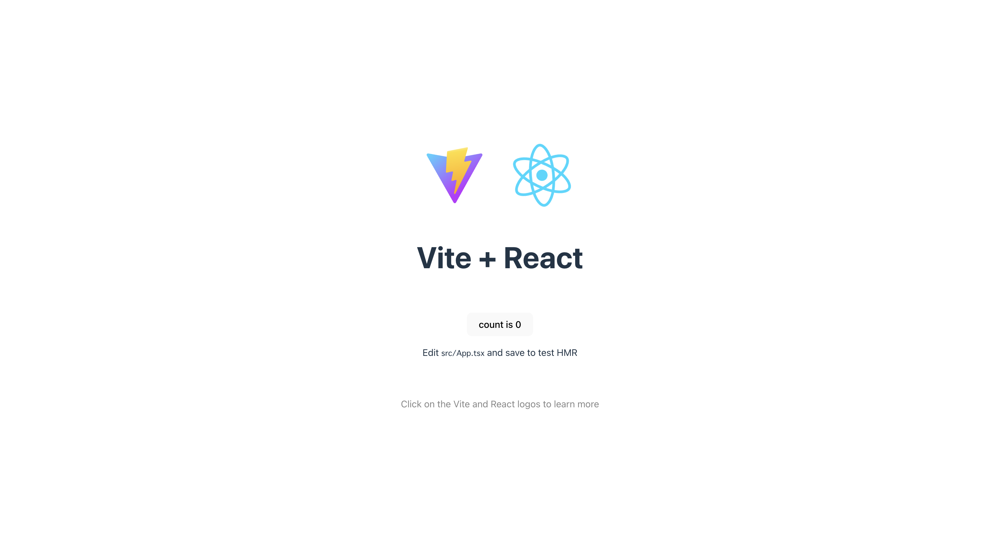

# 2 - 環境構築
HTML や CSS、JavaScript で Web ページを作った際はそれぞれに対応するファイルを作成するだけで良かったですが、React を使用して Web ページを構築する際には、少し複雑な環境構築を要します。本章では React を取り巻くツールなどについて述べた後、実際の環境構築の方法を解説していきます。

## 2.1 React を取り巻くツール
### 2.1.1 Node.js
React は Node.js 用のライブラリです。**Node.js とはコンピュータ用の JavaScript ランタイム**で、従来 Web ブラウザ上で動作していた JavaScript をコンピュータ上で動かすためのソフトウェアです。React をはじめとした現在の Web アプリケーション開発で使用されるツール群の多くは Node.js 上で動作するので、今日 Web 開発をする際には必須のソフトウェアであると言っていいでしょう。

なお現在は Node.js 以外にも Deno や Bun といった JavaScript ランタイムがあり、特に速度などのパフォーマンスの点では後者の方が優れているとされています。しかし Node.js が長く利用されてきたゆえに文献が成熟しており、トラブルシューティングはほぼ [StackOverflow](https://stackoverflow.com/) 等のサイトを閲覧することで完結することができます。従って、初心者が扱いやすいという点で、本書では Node.js を採用しています。

### 2.1.2 npm
**npm は Node Package Manager の略で、いわゆるパッケージマネージャ**です。パッケージとはライブラリやモジュールといった概念を包含するもので、公開されたオープンソースのコードと考えて差し支えないでしょう。プログラミングの世界では、**他人が書いたプログラムを自分のプロジェクトに導入して利用するという、ライブラリ**などと呼ばれる概念がありますが、これらを管理するためのツールが npm です。

例えば自分のプロジェクトでライブラリ A を使用するとします。そして、ライブラリ A は別のライブラリ B と C に依存しているとします。このとき、自分のプロジェクトのプログラムを正しく動作させるには、自分のプログラムに加えてライブラリ A, B, C すべてのプログラムが必要です。npm はこのように、ライブラリの依存関係を解析して必要なライブラリを集め（これを**解決**と言います）、管理する役割を果たす、重要なツールです。

npm は通常 Node.js に同梱されているため、追加でインストールする必要はありません。また、最近では yarn や pnpm などのパッケージマネージャも登場していますが、Node.js と同様の利用で npm を採用しています。

### 2.1.3 Vite
**Vite（ヴィート）は Web 開発の場面で利用されるモジュールバンドラ**です。**バンドルとは、ライブラリやプログラムの依存関係を解決・結合すること**を指します。従来は Webpack と呼ばれるモジュールバンドラが利用されてきましたが、Vite はブラウザの [Native ES Modules](https://zenn.dev/uhyo/articles/what-is-native-esm-era) を使用するなどの理由で高速に動作することが特徴です。

また、Vite を利用することで **HMR（Hot Module Reload = ファイルの変更を検知して画面のリロードを行うことなく再描画を行うこと）** ができます。これは Webpack でも可能でしたが、Vite は部分的に再度トランスパイル（言語どうしの相互変換、ここでは TypeScript → JavaScript）を行うことができるためやはり高速です。

## 2.2 環境構築
### 2.2.1 Node.js のインストール
Node.js のインストール方法は主に 2 つあります：

- Node.js を直接インストールする
- nvm などを用いて間接的にインストールする

nvm は Node.js のバージョンを管理できるツールです。インストール自体は前者の方が圧倒的に簡単ですが、今後のことも考慮し本書では nvm を利用していきます。

- [Windows](https://zenn.dev/y_2_k/articles/e419bcf729e82d)
- [macOS](https://qiita.com/ffggss/items/94f1c4c5d311db2ec71a)


### 2.2.2 プロジェクトの作成
Node.js がインストールできたら、早速プロジェクトを作成していきます。以下の作業は Windows / macOS 共通です。なお、作業前にプロジェクトを作成しても良い適当なディレクトリに移動しておいてください。

まず、次のコマンド群を順に実行していきます。なお、最初のコマンドを実行するといくつか質問がされますが、次のように設定してください。

- Select a framework: `React`
- Select a variant: `TypeScript`

```sh
# samnple-app プロジェクトを作成する
npm create vite@latest sample-app

# sample-app ディレクトリに移動する
cd sample-app

# パッケージのインストール
npm install
```

ここまで終わったら、あとは開発サーバを起動してブラウザからアクセスするだけです。次のコマンドで開発サーバを起動してみましょう。

```sh
npm run dev
```

そして http://localhost:5173 にブラウザでアクセスします。おそらく画像のような画面が表示されるはずです。



素晴らしい画面が出てきて感動できますが、今後使用するためにサンプルのコードは削除しておきましょう。

**src/App.tsx**
```tsx
function App() {

  return (
    <>
    </>
  );
}

export default App
```

**src/main.tsx**
```tsx
import React from 'react'
import ReactDOM from 'react-dom/client'
import App from './App.tsx'

ReactDOM.createRoot(document.getElementById('root')!).render(
  <React.StrictMode>
    <App />
  </React.StrictMode>,
)
```

- **src/App.css**：中身を空にする
- **src/index.css**：中身を空にする
- **src/assets**：削除

おめでとうございます！これで環境構築は完了です。