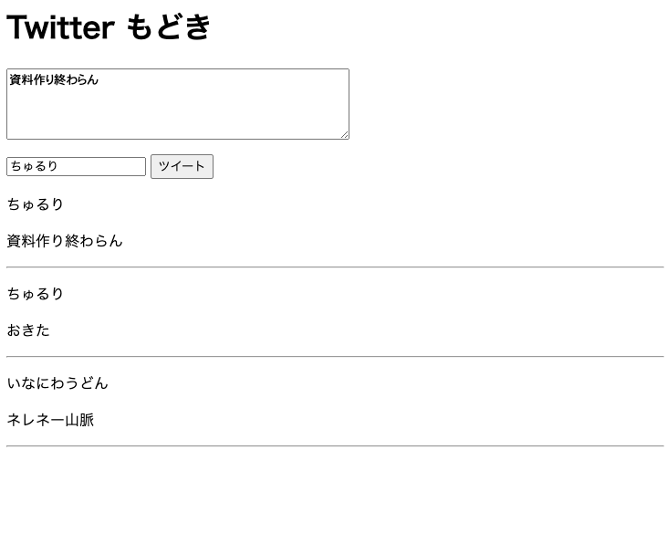

# 6 - TSX 2
4 章では、コンポーネントの定義方法や props、式の表示などについて扱いました。本章では、React のコンポーネントにおける繰り返しや条件分岐の手法について述べていきます。

## 6.1 繰り返し
React では、繰り返しの手法を用いることによって同じコンポーネントを任意の数だけ表示させることができるようになります。次の例は、5 章で出てきた `Names.tsx` の名前の表示方法を箇条書きに改善したプログラムです。

**Names2.tsx**
```tsx
import { useState } from "react";

export default function Names() {
  const [name, setName] = useState<string>("");
  const [names, setNames] = useState<string[]>([]);

  // ボタンがクリックされた時のイベントハンドラ
  const onClickButton = () => {
    setNames((previousNames) => [...previousNames, name]);
  };

  return (
    <div>
      <input
        type="text"
        value={name}
        onChange={(event) => setName(event.target.value)}
      />
      <button onClick={onClickButton}>名前を追加</button>
      <ul>
        {names.map((name, index) => (
          <li key={index}>{name}</li>
        ))}
      </ul>
    </div>
  );
}
```

このプログラムでは、`names.join()` によって行っていた処理が次のように変更されています。

```tsx
{names.map((name, index) => (
    <li key={index}>{name}</li>
))}
```

このように、**配列に対して `map` 関数を呼び出し、その返り値としてコンポーネントを返してあげることで繰り返してコンポーネントを表示することができます**。[Array.prototype.map() - JavaScript | MDN](https://developer.mozilla.org/ja/docs/Web/JavaScript/Reference/Global_Objects/Array/map) には、`map` 関数は次のような挙動をすると述べられています。

> `map()` は `Array` インスタンスのメソッドで、与えられた関数を配列のすべての要素に対して呼び出し、その結果からなる新しい配列を生成します。

上記の例のように、単一のコンポーネントを返すのであれば、`=>` の後のコンポーネントを `()` で囲ってあげれば良いですが、複数の文からなる処理を記述して最終的にコンポーネントを返したいのであれば、次の例のように **`{}` と `return` 文を使用する必要**があります。

```tsx
{names.map((name, index) => {
    const prefix = "test";
    return <li key={index}>{prefix}:{name}</li>;
})}
```

また、**繰り返されるコンポーネントの最親のコンポーネントには `key` 属性を渡す**必要があります。通常、この値は繰り返しのインデックスを指定します。

## 6.2 演習 1
`src/components/TwitterModoki.tsx` を作成して、次のようなコンポーネントを作成して下さい。ただし、今までに作成した `Tweet` と `CreateTweet` コンポーネントを使用して下さい（必要に応じて内容は修正して下さい）。

1. CreateTweet コンポーネントにて文字が入力できるようになっている
2. 「ツイート」ボタンを押すとツイート入力欄にツイートが表示される
3. 画面イメージ


<details>
    <summary>ヒント</summary>
    <p>今回の問題設定はやや難しめです。まず必要なものを整理してみます。</p>
    <ol>
        <li>名前とツイート内容の組がセットになったデータを保持するための状態</li>
        <li>「ツイート」ボタンがクリックされたとき用のイベントハンドラとなる関数</li>
        <li>各ツイートのコンポーネントを包含するための要素</li>
    </ol>
    <p>そして、おそらく 2 の関数が CreateTweet コンポーネントの onSubmitTweet prop として渡されるべきでしょう。2 のイベントハンドラの中では、引数として受け取ったデータを元に 1 の状態を更新する必要があります。</p>
</details>

## 6.3 条件分岐
React では、状態や props の値に応じて表示するコンポーネントを出し分ける条件分岐のための仕組みがあります。次の例は、入力された値が 2 で割り切れるかどうかによって表示が切り替わるコンポーネントです。

**IsEven.tsx**
```tsx
type Props = {
  n: number;
};

export default function IsEven(props: Props) {
  return (
    <div>
      {props.n % 2 === 0 && <p>偶数</p>}
      {props.n % 2 === 0 || <p>奇数</p>}
    </div>
  );
}
```

条件分岐によるコンポーネントの出し分けは、コンポーネントの中に `{ 条件式 && 条件式が真のときのコンポーネント }` または `{ 条件式 || 条件式が偽のときのコンポーネント }` と記述して行うことができます。**`{}` の中の記述は全体としては論理式**なので、本質的には 4 章で述べた式の表示と変わりがありません。

`&&` なら真のとき、`||` のときは偽のときという記述は直感的には理解しづらいかもしれません。ただし、これに関しても条件式の挙動を考えることによって理解することができます。

まず、`&&` や `||` などの演算子は、JavaScript における AND 式や OR 式の評価に使用されます。一般に JavaScript においては、これらの演算子による式の全体としての値はその最後の項となります。このことを念頭においた上で `&&` の評価について考えてみます。なお、以下の説明で使用されている**部分式**とは、例えば `A && B || C` などの式における `A, B, C` のことを指します。

`&&` 式では全体として真になる必要があるので、`&&` で結合された部分式の全てが真となる必要があります。**JavaScript では部分式は左から順に評価されていく**ので、コンポーネントが最後の部分式となっていれば、**一つ前までの部分式が順に真と評価されていくことで最終的にコンポーネントの評価まで到達**します。コンポーネントは紛れもなく `null` でないオブジェクトなので、式全体として真になり、最後の項であるコンポーネントが式の値となります。

一方で `||` 演算子はどうでしょうか。OR 式の評価には**短絡評価**と呼ばれる評価方法があり、この方法で**は式を構成する部分式のいずれかが真となれば式全体の評価結果も真**になります。即ち、部分式を最後まで評価しないことがあるわけです。JavaScript も短絡評価を採用しているため、左から順に部分式が評価されることを考えれば、式の最後の部分式が評価されるのはそれより前の部分式が全て偽だった場合のみです。この特性を利用すれば、最後の部分式にコンポーネントを置けば上述の通り全体としては真と評価されるので、やはり式の値はコンポーネントとなります。

## 6.4 演習 2
`src/components/TwitterModoki.tsx` を修正して、投稿されたツイートがない時には「ツイートはありません」、そうでないときにはこれまで通りツイートが表示されるようにして下さい。

<details>
    <summary>ヒント</summary>
    ツイートの有無は、ツイートを保持する状態変数（おそらく配列だと思います）の長さをみることによって判断することができます。即ち、その長さが 0 であるかそうでないかによって条件分岐をすればいいでしょう。
</details>