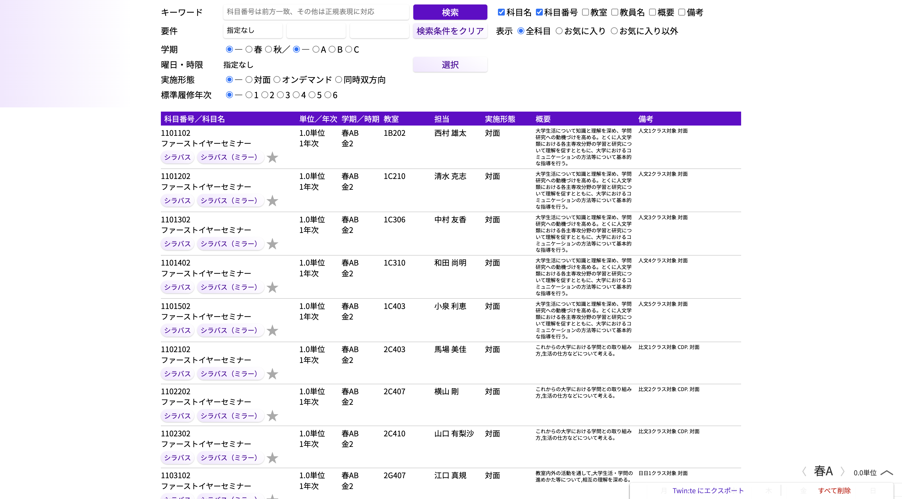

# 9 - 演習
本研修の最終的な課題として、[Kdbもどき](https://make-it-tsukuba.github.io/alternative-tsukuba-kdb/)のクローンを作成してください。Kdb もどきは本研修の講師である[いなにわうどん](https://x.com/kyoto_inaniwa)を筆頭に、有志によって開発された筑波大学生向けの授業検索ツールです。



推奨する実装の順番は次の通りです。

- 新規 React プロジェクトの作成
  - kdb-modoki-sample として作成
- 各行のコンポーネントの作成
- ヘッダのキーワードの部分と検索ボタンの作成
- 科目番号による検索
- デザイン
- その他機能の拡充

なお授業データの取得方法には非同期処理が必要ですが、本研修では取り扱っていません。そのため授業データを取得する部分のみのコードを下に与えます。このコードをコンポーネント内に記述してください。加えて、データには 2024/6/15 時点の Kdb データを使用しています。以下のコードを実行する前に `day1/phase1/sample/kdb.json` を `kdb-modoki-sample/public` 以下に `kdb.json` としてコピーしてください。

```tsx
import { useState, useEffect} from "react";

// ここからコンポーネントの内部
  const callback = async () => {
    const DATA_URL =
      "kdb.json";

    const response = await fetch(DATA_URL);
    if (!response.ok) {
      alert("データ取得エラー");
      return [];
    }

    const data = (await response.json()) as unknown as KdbData;
    setKdbData(data);
  };

  useEffect(() => {
    (async () => await callback())();
  }, []);
// ここまで
```

`kdb.json` の冒頭部分は次の通りです。上記のプログラムに加えて、このデータから類推して型 `KdbData` も作成してください。

```json
{
  "updated": "2024/06/15",
  "subject": [
    [
      "1101102",
      "ファーストイヤーセミナー",
      "2",
      " 1.0",
      "1",
      "春AB",
      "金2",
      "1B202",
      "西村 雄太",
      "大学生活について知識と理解を深め、学問研究への動機づけを高める。とくに人文学類における各主専攻分野の学習と研究について理解を促すとともに、大学におけるコミュニケーションの方法等について基本的な指導を行う。",
      "人文1クラス対象 対面"
    ],
    [
      "1101202",
      "ファーストイヤーセミナー",
      "2",
      " 1.0",
      "1",
      "春AB",
      "金2",
      "1C210",
      "清水 克志",
      "大学生活について知識と理解を深め、学問研究への動機づけを高める。とくに人文学類における各主専攻分野の学習と研究について理解を促すとともに、大学におけるコミュニケーションの方法等について基本的な指導を行う。",
      "人文2クラス対象 対面"
    ]
  ]
}
```

<details>
    <summary>解答（ここで詰まることは本質ではないので、わからなければ見てください！）</summary>
    <pre>
type Subject = {
  id: string;  // 科目番号
  name: string;  // 科目名
  method: number;  // 授業方式
  unit: number;  // 単位数
  grade: number;  // 標準履修年次
  module: string;  // 開講モジュール
  time: string;  // 曜時限
  place: string;  // 開講場所
  teachers: string;  // 教員
  description: string;  // 詳細
  remarks: string;  // 備考
};

type KdbData = {
  updated: string;  // 更新日時
  subject: Subject[];  // 科目
}
</pre>
</details>